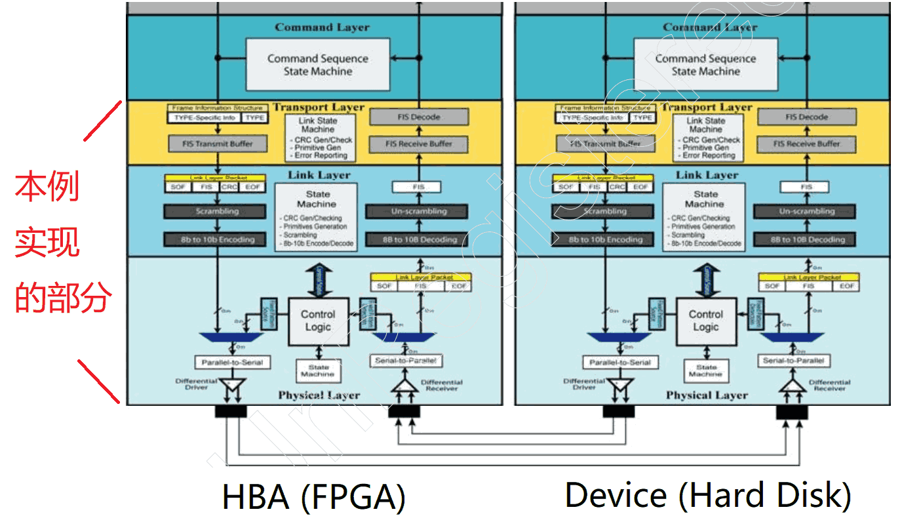
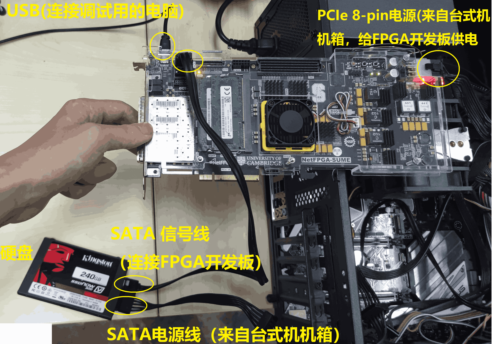
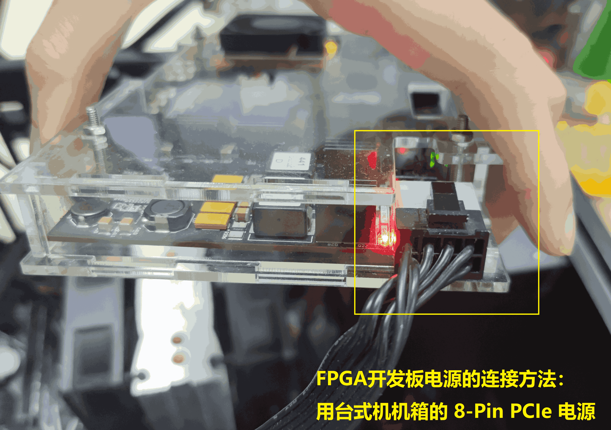
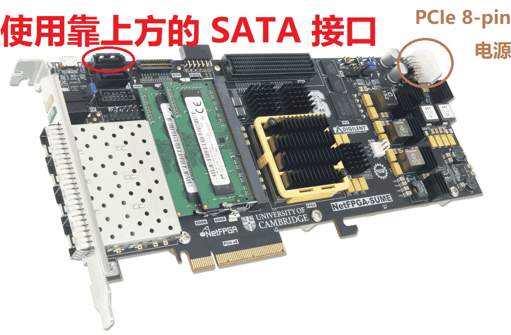
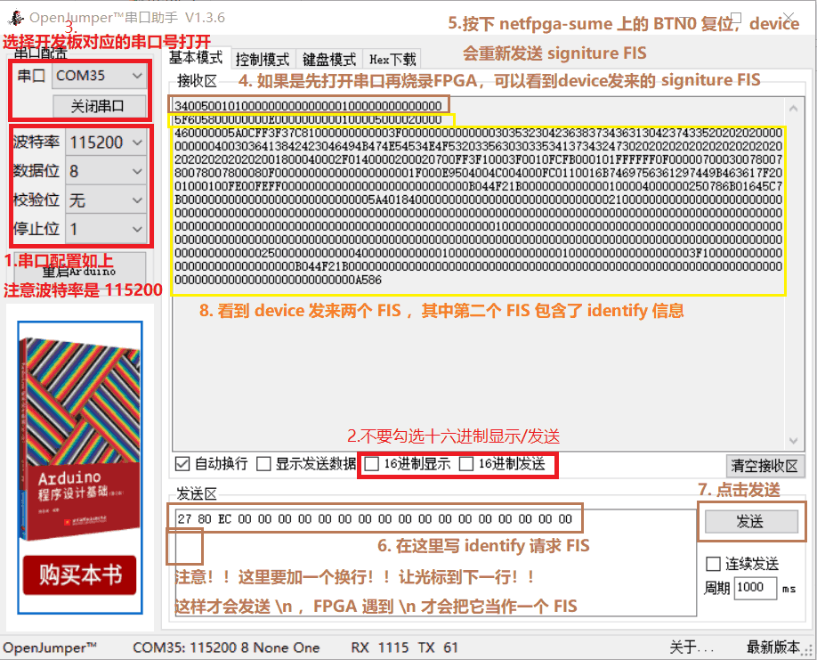
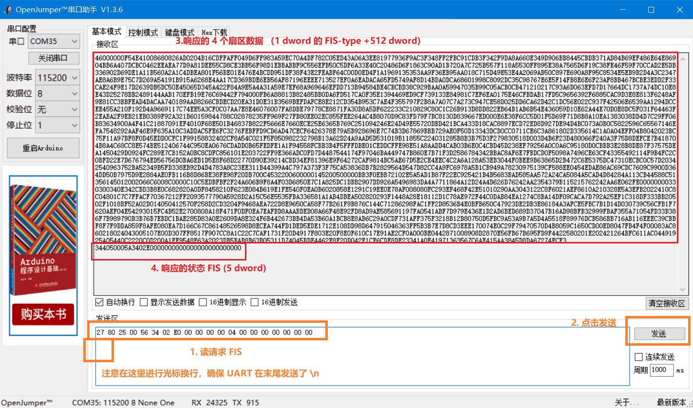
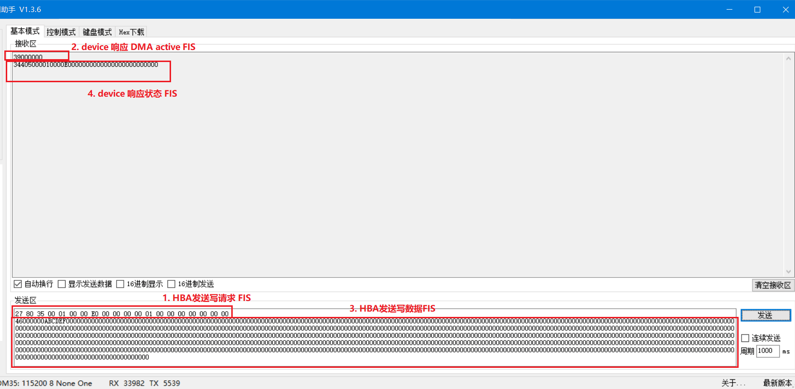

  

FPGA-SATA
===========================

SATA Gen2 host (HBA) ，可运行在具有 GTH 的 Xilinx FPGA 上。本库提供基于 [netfpga-sume](https://www.xilinx.com/products/boards-and-kits/1-6ogkf5.html) 官方开发板的示例，可实现硬盘读写。

另外，我写了一个介绍 SATA 的技术文章 [SATA协议浅析：从串行信号到读写硬盘](https://zhuanlan.zhihu.com/p/554251608) ，帮助大家理解 SATA 协议栈的细节。

# 简介

SATA是硬盘最广泛使用的接口协议。**图1**是SATA体系结构，其中 SATA host (HBA) 是硬盘读写控制器，在电脑中往往用主板芯片组来实现，在这里是 FPGA 实现。而 SATA device 就是硬盘（机械硬盘或固态硬盘）。

|  |
| :-----------------------------------: |
|         **图1**：SATA 协议栈          |

SATA 协议自下而上包含：物理层(Physical Layer, PHY)、链路层(Link Layer)、传输层(Transport Layer)、命令层(Command Layer) ：

- **物理层**：下游用两对串行差分信号对连接 SATA device ，包括发送用的差分对（SATA_A+, SATA_A-) 和接收用的差分对（SATA_B+, SATA_B-) 。进行串行信号的时钟恢复、串并转换后，用并行信号与上游的链路层进行交互。
- **链路层和传输层**：从下到上分别实现：8b10b 编解码、加扰/解扰、CRC计算和检验、流控、数据缓存、FIS数据包的封装和解析。与上游的命令层使用一种叫 **Frame Information Structures** (**FIS**) 的数据包结构进行交互。
- **命令层**：接受上游的读写命令，生成和解析FIS，实现硬盘读写操作。

本库仅仅用硬件实现了从物理层到传输层的功能，原因如下：

- 从物理层到传输层的功能虽然并不简单，但目的比较单一，仅仅是为了提供可靠的 FIS 传输机制，内部耦合度较高。而且 FIS 是统一的数据流格式，因此从传输层到命令层的数据接口较为简单，易于理解和使用。
- 之所以不实现命令层，是因为由于历史兼容性的原因，SATA 所支持的 ATA 和 ATAPI 等命令集所规定的硬盘读写方式较多，包括 PIO 、 DMA 等，因此一个完整的命令层需要实现众多繁杂的命令的状态机。但其目的并不复杂，都是为了用各种方式来实现硬盘读写。

本库对各层的实现方法如下：

- 虽然没有用硬件实现命令层，但我在 FPGA 内实现了一个用 UART 收发 FIS 的示例工程，提供了 UART “FIS透传” 功能：你可以用电脑中的串口软件（比如minicom, putty, hyper-terminal, 串口助手等）来发送 FIS 给 Device，并能看到 Device 发来的 FIS 。基于此，只要我们按命令层规定的 FIS 格式来发送数据，就能实现硬盘的读写。
- 链路层和传输层用 Verilog 实现，但不包括链路层中的 8b10b 编解码，这是因为 Xilinx 的 GT 原语能实现 8b10b  编解码。
- 物理层：用 Xilinx 的 GTH 原语实现。因此本工程支持的是具有 GTH 的 Xilinx FPGA ，比如 Virtex7 、Zynq Ultrascale+ 等。


# 代码文件

以下是本工程的代码文件的树形结构：

- vivado_netfpgasume/**fpga_top.xdc** : 引脚约束文件，把端口约束到  [netfpga-sume](https://www.xilinx.com/products/boards-and-kits/1-6ogkf5.html) 的引脚上。
- RTL/fpga_uart_sata_example/**fpga_uart_sata_example_top.sv** : FPGA工程顶层 (**Verilog**)
  - RTL/IP/clk_wiz_0 : 生成 60MHz 时钟提供给 SATA HBA core 的 CPLL_refclk (**Xilinx clock wizard IP**)
  - RTL/sata_hba/**sata_hba_top.sv** : SATA HBA 顶层，实现物理层、链路层、传输层 (**Verilog**)
    - RTL/sata_hba/**sata_gth.sv** : 实现物理层，调用了 Xilinx GTH 相关的原语 (**Verilog**)
    - RTL/sata_hba/**sata_link_transport.sv** : 实现了链路层和传输层 (**Verilog**)
  - RTL/fpga_uart_sata_example/**uart_rx.sv** : 接收 Host-PC 发来的 UART 信号，把它解析成 FIS 数据流发送给 HBA (**Verilog**)
  - RTL/fpga_uart_sata_example/**uart_tx.sv** : 接收 HBA 收到的 FIS，把它转换成人类可读的 ASCII-HEX 格式并用 UART 发送给 Host-PC (**Verilog**)

|                   |
| :----------------------------------------------------------: |
| **图2** ： 本库的代码结构。其中 xfis 代表 FIS 发送流，rfis 代表 FIS 接收流。 |


# SATA HBA 模块接口说明

RTL/sata_hba/**sata_hba_top.sv** 是 SATA HBA core 的顶层模块，具有简洁的 FIS 收发接口。如果你想实现其它 SATA 应用，比如自己编写命令层，需要充分理解 **sata_hba_top.sv** 的接口波形。

首先我们需要理解 FIS 数据包的结构，如下表。FIS 的长度一定是 4 byte 的倍数。其中 CRC 对模块调用者是不可见的，因为 **sata_hba_top.sv** 会自动插入、检查并删除。模块调用者仅需把 FIS-type 字段和 Payload 字段当成一个整体来发送和接收。在下文的语境中，我们用 **FIS长度** 指代 FIS-type + Payload 字段的总长度（最小 1 dword, 最大 2049 dword），而不包括 CRC 。

​    *表：FIS 数据包结构*

|     字段     |   FIS-type   |   Payload    |              CRC              |
| :----------: | :----------: | :----------: | :---------------------------: |
| 长度 (byte)  |      4       |   0\~8192    |               4               |
| 长度 (dword) |      1       |   0\~2048    |               1               |
|     发送     | 需要用户发送 | 需要用户发送 | 不需要用户发送 (硬件自动插入) |
|     接收     |   用户可见   |   用户可见   |  用户不可见 (硬件检查并删除)  |

> :point_right: dword 术语翻译为“双字”，代表4个字节。


以下是 **sata_hba_top.sv** 的接口定义，其中 **rfis_** 开头的信号构成了类似 AXI-stream source 的接口，会向用户发送收到的 FIS 。 **xfis_** 开头的信号构成了类似 AXI-stream sink 的接口，用户要用它来发送 FIS 。它们都与 clk 时钟信号同步。

```verilog
module sata_hba_top (     // SATA gen2
    input  wire        rstn,          // 0:reset   1:work
    input  wire        cpll_refclk,   // 60MHz clock is required
    // SATA GT reference clock, connect to clock source on FPGA board
    input  wire        gt_refclkp,    // 150MHz clock is required
    input  wire        gt_refclkn,    //
    // SATA signals, connect to SATA device
    input  wire        gt_rxp,        // SATA B+
    input  wire        gt_rxn,        // SATA B-
    output wire        gt_txp,        // SATA A+
    output wire        gt_txn,        // SATA A-
    // user clock output
    output wire        clk,           // 75/150 MHZ user clock
    // =1 : link initialized
    output wire        link_initialized,
    // to Command layer : RX FIS data stream (AXI-stream liked, without tready handshake, clock domain = clk)
    //   example wave :               // |  no data  |  FIS1 (no error)  |  no data  | FIS2 (error) |   no data   |  FIS3 (no error)  |   no data   |
    output wire        rfis_tvalid,   // 000000000000111111111111111111111000000000000000000000000000000000000000011111111111111111111100000000000000     // rfis_tvalid=1 indicate rfis_tdata is valid. rfis_tvalid is always continuous (no bubble) when output a FIS
    output wire        rfis_tlast,    // 000000000000000000000000000000001000000000000000000000000000000000000000000000000000000000000100000000000000     // rfis_tlast=1  indicate this data is the last data of a FIS
    output wire [31:0] rfis_tdata,    // XXXXXXXXXXXXDDDDDDDDDDDDDDDDDDDDDXXXXXXXXXXXXXXXXXXXXXXXXXXXXXXXXXXXXXXXXDDDDDDDDDDDDDDDDDDDDDXXXXXXXXXXXXXX     // data, little endian : [7:0]->byte0, [15:8]->byte1, [23:16]->byte2, [31:24]->byte3
    output wire        rfis_err,      // 000000000000000000000000000000000000000000001000000000000000000000000000000000000000000000000000000000000000     // indicate a error FIS is detected (CRC error or illegal length), the error FIS do not effect rfis_tvalid, rfis_tlast and rfis_tdata
    // from Command layer : TX FIS data stream (AXI-stream liked, clock domain = clk)
    //   example wave :               // | idle  | write FIS1 to buffer  |  FIS1 transfer in progress (no error) |  idle  |  write FIS2 to buffer |  FIS2 transfer in progress (error)  |  idle  |
    input  wire        xfis_tvalid,   // 000000001111101001110111101111110000000000000000000000000000000000000000000000000111111111111111111111111000000000000000000000000000000000000000000000000     // xfis_tvalid=1 indicate xfis_tdata is valid, that is, user want to write data to internal TX FIS buffer. xfis_tvalid handshake with xfis_tready (data will write successfully to TX FIS buffer only when xfis_tvalid=xfis_tready=1). xfis_tvalid allows continuous (no bubble) or discontinuous (insert bubbles)
    input  wire        xfis_tlast,    // 000000000000000000000000000000010000000000000000000000000000000000000000000000000000000000000000000000001000000000000000000000000000000000000000000000000     // xfis_tlast=1  indicate this data is the last data of a FIS. this FIS will transfer to SATA device in progress after xfis_tlast=1 (xfis_tready turn to 0)
    input  wire [31:0] xfis_tdata,    // XXXXXXXXDDDDDXDXXDDDXDDDDXDDDDDDXXXXXXXXXXXXXXXXXXXXXXXXXXXXXXXXXXXXXXXXXXXXXXXXXDDDDDDDDDDDDDDDDDDDDDDDDXXXXXXXXXXXXXXXXXXXXXXXXXXXXXXXXXXXXXXXXXXXXXXXX     // data, little endian : [7:0]->byte0, [15:8]->byte1, [23:16]->byte2, [31:24]->byte3
    output wire        xfis_tready,   // 111111111111111111111111111111110000000000000000000000000000000000000000111111111111111111111111111111111000000000000000000000000000000000000001111111111     // xfis_tready=1 indicate FIS transfer is idle, user is allowed to write data to internal TX FIS buffer. while xfis_tready=0 indicate FIS transfer in progress, user is NOT allowed to write data to TX FIS buffer. xfis_tvalid handshake with xfis_tready (data will write successfully to TX FIS buffer only when xfis_tvalid=xfis_tready=1). xfis_tready will turn to 1 at the next cycle of xfis_done=1
    output wire        xfis_done,     // 000000000000000000000000000000000000000000000000000000000000000000000001000000000000000000000000000000000000000000000000000000000000000000000010000000000     // xfis_done=1 when FIS transfer progress ending, xfis_done=1. and xfis_tready will turn to 1 at the next cycle.
    output wire        xfis_err       // 000000000000000000000000000000000000000000000000000000000000000000000000000000000000000000000000000000000000000000000000000000000000000000000010000000000     // when xfis_done=1, xfis_err=1 indicates FIS transfer error (the SATA device feedback R_ERR).
);
```

关于接口波形，请看以上接口代码的注释。

对 **rfis_** 开头的各信号（接收 FIS 的通道）说明如下：

- rfis_tvalid : rfis_tvalid=1 表示 rfis_tdata 有效。 rfis_tvalid 在输出 FIS 时始终是连续的（也即无气泡，例如 device 发来一个长度是 257 dword 的 FIS，则连续 257 个时钟周期内保持 rfis_tvalid=1）。
- rfis_tlast : 当 rfis_tvalid 和 rfis_tlast 同时=1 时，表示这个数据是一个 FIS 的最后一个 dword 。该信号用于界定 FIS 的边界。
- rfis_tdata : 当 rfis_tvalid=1 时，rfis_tdata 上出现一个 dword 的有效的FIS数据。rfis_tdata 是小端序，rfis_tdata[7:0] 是最低字节，rfis_tdata[31:24] 是最高字节。
- rfis_err : 当 rfis_err=1 时，说明 HBA 收到了一个错误的 FIS （CRC错误或长度不合法）。错误的 FIS 仅仅会引起 rfis_err=1 ，而不会影响 rfis_tvalid, rfis_tlast , rfis_tdata 信号，这是因为本模块内有缓存丢弃机制，错误的 FIS 并不会在 rfis_tdata 上传输。

对 **xfis_** 开头的各信号（接收 FIS 的通道）说明如下：

- xfis_tvalid : xfis_tvalid=1 表示 xfis_tdata 有效，即用户想将数据写入 HBA 内部 TX FIS 缓冲区。 xfis_tvalid 与 xfis_tready 握手（只有当 xfis_tvalid=xfis_tready=1 时，数据才会成功写入 TX FIS 缓冲区）。 xfis_tvalid 允许连续（无气泡）或不连续（插入气泡）
- xfis_tlast : xfis_tlast=1 表示用户当前发送的数据是 TX FIS 的最后一个数据。该信号用于界定 FIS 的边界。 在 xfis_tlast=1  之后，HBA内部进入发送状态，xfis_tready变为0，不再接收用户发来的新数据，直到该FIS被HBA发送给device为止，xfis_tready恢复1。
- xfis_tdata : 当 xfis_tvalid=1 时，xfis_tdata 上需要出现一个 dword 的有效的FIS数据。xfis_tdata 是小端序，xfis_tdata[7:0] 是最低字节，xfis_tdata[31:24] 是最高字节。
- xfis_tready : xfis_tready=1 表示 HBA 内部不处于发送状态，此时用户可以写入FIS数据。xfis_tready=0 表示 HBA 正在发送数据给device ，此时用户即使令 xfis_tvalid=1 也会被忽略。xfis_tready 只有在两种情况下会从 1 变成 0 ：要么因为 xfis_tlast=1 而开始发送数据给device ，要么因为检测到link断开（比如SATA电缆被拔下）。
- xfis_done : 当HBA向device传输FIS数据的进度结束时，出现一个时钟周期的 xfis_done=1 。 并且 xfis_tready 将在下一个时钟周期变为 1。
- xfis_err : 当 xfis_done=1 时，xfis_err=1 表示 FIS 传输出错（是因为在发送完 FIS 后检测到 device 反馈了 R_ERR ，说明 device 检测到了 CRC 错误）。


# 运行示例工程

本节介绍用本示例工程通过 FPGA 读写硬盘的全过程。

### 硬件准备

- [netfpga-sume](https://www.xilinx.com/products/boards-and-kits/1-6ogkf5.html) 开发板
- SATA 接口的固态硬盘或机械硬盘（我成功地测过了 SV300S37A 固态硬盘 和 WD1600JS 机械硬盘）
- 一个台式机机箱，仅仅用于给 [netfpga-sume](https://www.xilinx.com/products/boards-and-kits/1-6ogkf5.html) 和 硬盘供电。因此需要有 8-pin PCIe 扩展卡电源接口和 SATA 电源接口。
- SATA 数据线一根（从台式机机箱里拆一根下来即可）
- 一台装有 vivado 的电脑：用 USB 连接 netfpga-sume ，用于工程编译、下载、以及通过 USB 接口与 netfpga-sume 进行 UART 通信。

### 硬件连接

硬件连接如**图3**\~**图5** 。

|  |
| :--: |
| **图3**：硬件连接 |

|    |
| :--------------------------------: |
| **图4**：netfpga-sume 开发板的供电 |

|          |
| :--------------------------------------: |
| **图5**：netfpga-sume 开发板的 SATA 接口 |

### 编译和烧录程序

用 vivado 打开 vivado_netfpgasume/sata_netfpgasume.xpr 工程文件，编译并烧录。（我用的是 vivado 2019.1，如果你因为版本不兼容而无法打开工程，请重新建立工程，并手动添加工程相关的文件，注意 FPGA 的型号应该选 **xc7vx690tffg1761-3** ）

烧录程序后，netfpga-sume 上的 LD0 亮说明 clk_wiz_0 正常工作。 LD1 亮说明 SATA 连接建立。本工程支持热插拔，如果拔下硬盘，LD1 会熄灭。重新插入后又会点亮。（虽然支持，但不建议对硬盘进行热插拔）

如果你插入硬盘后 LD1 始终不亮，可以按下 netfpga-sume 上的 BTN0 对系统进行复位。


# 用 UART 收发 FIS 来读写硬盘

本例中的 uart_rx.sv 模块会把用户发送的 ASCII-HEX （人类可读）格式的 UART 数据转成 SATA HBA 模块所接受的 AXI-stream 格式；uart_tx.sv 模块会把 SATA HBA 发送的 AXI-stream 转成 ASCII-HEX 的 UART 格式。因此支持使用串口调试软件 （比如minicom, putty, hyper-terminal, 串口助手）进行 “FIS透传”。在此基础上我们需要按**命令层**规定的 FIS 格式来发送FIS，即可完成读写。

### UART 收发 FIS 的格式

设一个 FIS 有 5个 dword，如下（十六进制），其中第一个 dword 是 FIS type ，后4个 dword 是 payload ，这也是 xfis_tdata 和 rfis_tdata 信号上依次出现的数据：

```
0058605F E0000000 00000000 50000001 00000200
```

我们需要先把它表示成逐个 byte 的格式，注意 dword 是**小端序**，因此低位 byte 在前，高位 byte 在后：

```
5F 60 58 00 00 00 00 E0 00 00 00 00 01 00 00 50 00 02 00 00
```

如果这个 FIS 是 device 发给 HBA 的，则 UART 会收到如下的字符串。其中每个字符以 ASCII 码对应的字节在 UART 上进行传输 ， ‘\n’ 是换行符，也即ASCII码的 0x0A ； '5' 是 ASCII 码的 0x35 ， 'F' 是 ASCII 码的 0x46 

```
5F605800000000E0000000000100005000020000\n
```

如果这个 FIS 是 HBA 发给 device 的，则 UART 格式类似，如下，用户只需要用 UART 发送如下字符串即可。注意 '\n' 必须要发送，FPGA会用它来判断一个 FIS 的结尾。

```
5F605800000000E0000000000100005000020000\n
```

并且还支持更自由的格式，可以在各个字符见任意插入空格，还可以在结尾加入 '#' 号来添加注释，FPGA会筛选掉这些空格和注释。

比如你也可以发送如下字符串，与上面的是等效的（但是始终注意一个FIS的结尾要加 '\n'） ：

```
5F605800 0000 00E0 00000000 01 000050 00020000   #example TX FIS \n
```


### 进行硬盘 identify

在读写前，我们要向硬盘发起 identify 请求 FIS ，该 FIS 包含 5 个 dword :

```
00EC8027 00000000 00000000 00000000 00000000
```

因此需要用UART发送如下字符串：

```
27 80 EC 00 00 00 00 00 00 00 00 00 00 00 00 00 00 00 00 00\n
```

按**命令层**的规定，硬盘会响应两个 FIS ，长度分别为 5 个 dword 和 129 个 dword 。关于这两个 FIS 的含义，请看参考资料[1]，这里不做赘述。

以**串口助手**软件为例，需要按如**图6**来操作 。

|                                 |
| :----------------------------------------------------------: |
| **图6** : 用串口助手软件来查看 device signiture ，并进行 identify 。 |


### 用DMA方式进行硬盘读

**命令层**规定的读写方式很多，包括 PIO 和 DMA 等。其中 DMA 读写以**扇区**(sector) 为单位，每个扇区 512 byte (128 dword) 。用 48-bit LBA （logic block address, 逻辑块地址) 对扇区进行寻址，例如 LBA=0x000001234567 就代表第 0x1234567 个**扇区**。一次可以指定连续读写扇区的数量。

要进行DMA读，HBA 要发送 5 dword 长度的 DMA 读请求 FIS ，其格式如下 （详见参考资料[1] ）：

```
00258027 E0XXXXXX 00YYYYYY 000000ZZ 00000000
```

以上FIS中，XXXXXX 是 LBA[23:0] ，YYYYYY 是 LBA[47:24] 。ZZ 是读扇区的数量，一次可以读一个或多个扇区。

例如我们要对 LBA=0x000000023456 （也就是第 0x23456 个扇区）进行读，连续读 4 个扇区，则应该发送命令 FIS ：

```
00258027 E0023456 00000000 00000004 00000000
```

发送该命令后，硬盘会响应两个 FIS 给 HBA ：

- 第一个是读出的扇区数据 FIS ，长度为 1 dword 的 FIS type + 要读的数据长度 （比如以上命令读了4个扇区，则要读的数据长度是 2048 byte = 512 dword ）。注意数据 FIS 的 FIS type 字段是 00000046 。
- 第二个 FIS 是 5 个 dword 的状态响应 FIS 。

用串口助手进行该读操作，如**图7**  。

|                                 |
| :----------------------------------------------------------: |
| **图7** : 用串口助手软件来读硬盘（LBA=0x000000023456 , 扇区数量=4） |


### 用DMA方式进行硬盘写

>  :point_right:  注意！！如果你用电脑上拔下来的硬盘，就尽量不要写，这样会破坏数据，搞不好你的电脑都不能启动了！！请用废旧硬盘进行写操作！！

要进行DMA写，HBA 要发送 5 dword 长度的 DMA 写请求 FIS ，其格式如下：

```
00358027 E0XXXXXX 00YYYYYY 000000ZZ 00000000
```

以上FIS中，XXXXXX 是 LBA[23:0] ，YYYYYY 是 LBA[47:24] 。ZZ 是写扇区的数量，一次可以写一个或多个扇区。

例如我们要对 LBA=0x000000000001 进行写，只写 1 个扇区，则 HBA 应该发送命令 FIS ：

```
00358027 E0000001 00000000 00000001 00000000
```

然后按照命令层的规定，硬盘会响应 1 个 dword 的 DMA active FIS （它只有 FIS type 字段，且固定是 00000039 ，没有 payload ）：

```
00000039
```

然后 HBA 要发送写数据 FIS 给硬盘，是 1 dword 的 FIS type (00000046) + 1 个扇区（128 dword) 的数据。比如我们想把前三个字节分别写为 AB CD EF ，其余字节写为0，则该 FIS 应为：

```
00000046 00EFCDAB 00000000 00000000 00000000 00000000 00000000 00000000 00000000 00000000 00000000 00000000 00000000 00000000 00000000 00000000 00000000 00000000 00000000 00000000 00000000 00000000 00000000 00000000 00000000 00000000 00000000 00000000 00000000 00000000 00000000 00000000 00000000 00000000 00000000 00000000 00000000 00000000 00000000 00000000 00000000 00000000 00000000 00000000 00000000 00000000 00000000 00000000 00000000 00000000 00000000 00000000 00000000 00000000 00000000 00000000 00000000 00000000 00000000 00000000 00000000 00000000 00000000 00000000 00000000 00000000 00000000 00000000 00000000 00000000 00000000 00000000 00000000 00000000 00000000 00000000 00000000 00000000 00000000 00000000 00000000 00000000 00000000 00000000 00000000 00000000 00000000 00000000 00000000 00000000 00000000 00000000 00000000 00000000 00000000 00000000 00000000 00000000 00000000 00000000 00000000 00000000 00000000 00000000 00000000 00000000 00000000 00000000 00000000 00000000 00000000 00000000 00000000 00000000 00000000 00000000 00000000 00000000 00000000 00000000 00000000 00000000 00000000 00000000 00000000 00000000 00000000 00000000 00000000
```

写数据成功后，磁盘会发送 5 个 dword 的状态响应 FIS 给 HBA 。

用串口助手进行写操作，如**图8**  。注意数据 FIS 的长度不能多也不能少，否则会被 device 视为错误的 FIS 。

|                                 |
| :----------------------------------------------------------: |
| **图8** : 用串口助手软件来读硬盘（LBA=0x000000000001 , 扇区数量=1） |

写之后，可以读出来看看写是否成功，这里不再赘述。

关于更多的读写命令，请参考[1] 。


# 参考资料

[1] SATA Storage Technology : https://www.mindshare.com/Books/Titles/SATA_Storage_Technology

[2] Serial ATA: High Speed Serialized AT Attachment : https://www.seagate.com/support/disc/manuals/sata/sata_im.pdf

[3] Nikola Zlatanov : design of an open-source sata core : https://www.researchgate.net/publication/295010956_Design_of_an_Open-Source_SATA_Core

[4] Louis Woods et al. : Groundhog - A Serial ATA Host Bus Adapter (HBA) for FPGAs : https://ieeexplore.ieee.org/abstract/document/6239818/

[5] 【技术干货】SATA协议浅析：从串行信号到读写硬盘 : https://zhuanlan.zhihu.com/p/554251608?
